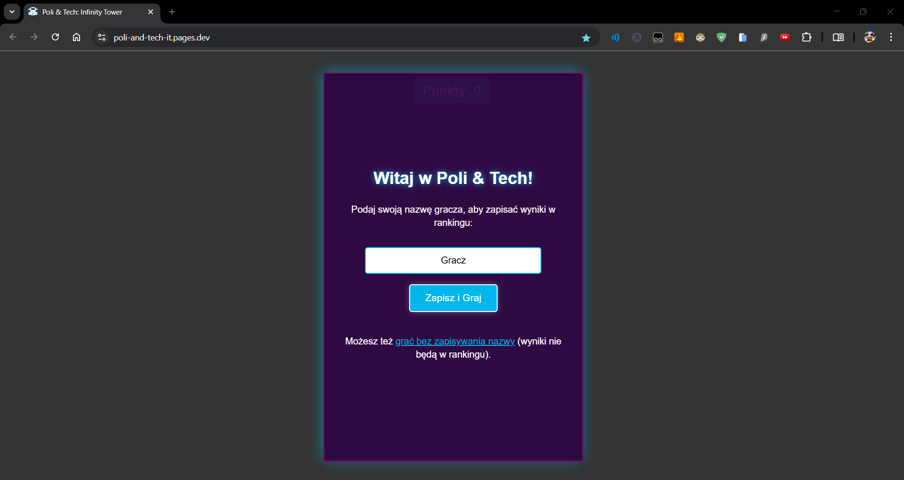
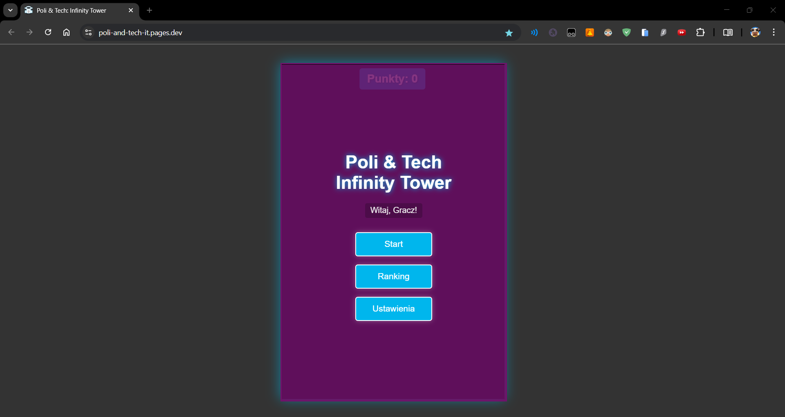
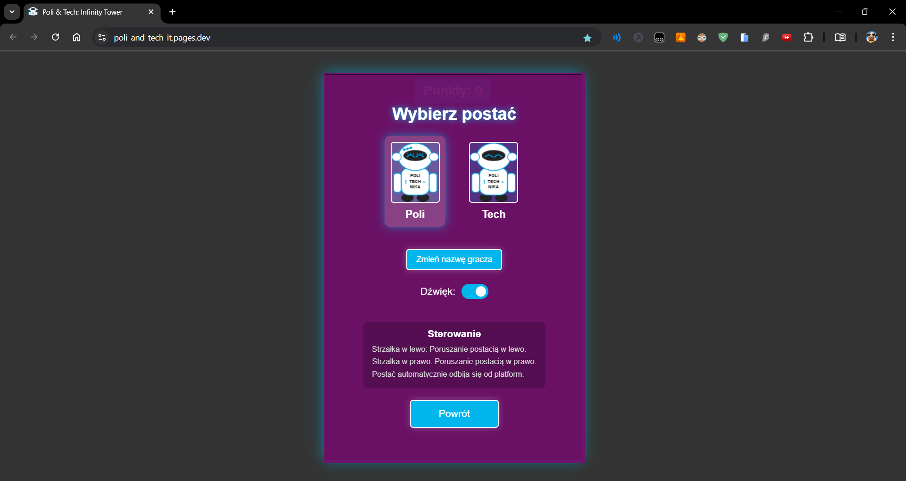
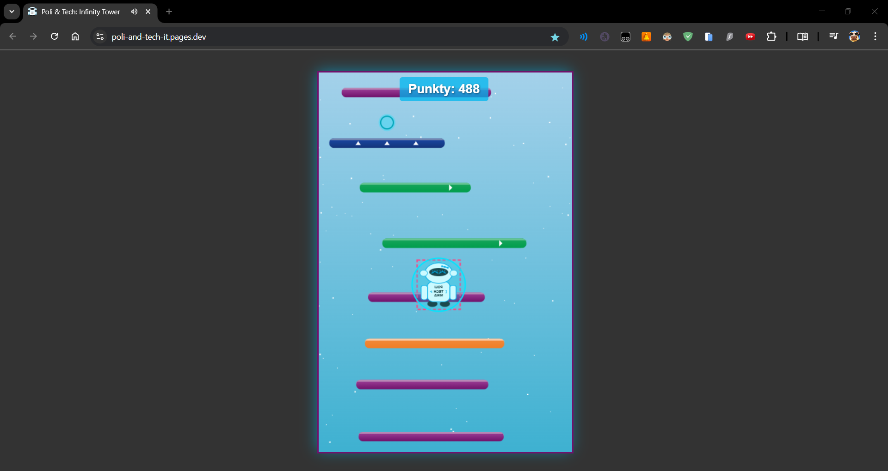
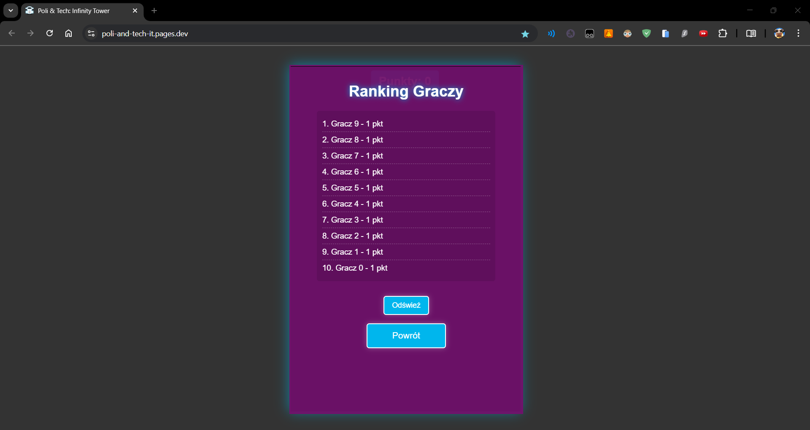

# Poli & Tech: Infinity Tower

## Opis Gry

**Poli & Tech: Infinity Tower** to wciągająca gra platformowa, w której gracze wcielają się w postacie Poli lub Techa, starając się wspiąć jak najwyżej po dynamicznie generowanych platformach. Celem gry jest osiągnięcie jak najwyższego wyniku poprzez wspinaczkę po niekończącej się wieży. Punkty naliczane są za osiągniętą wysokość oraz zbierane bonusy, a wyniki najlepszych graczy zapisywane są w rankingu online.

## Kluczowe Funkcje

*   **Dynamicznie Generowane Platformy:** Wieża platform jest generowana w czasie rzeczywistym, zapewniając niepowtarzalną rozgrywkę za każdym razem.
*   **Progresywny Poziom Trudności:**
    *   Szerokość platform zmniejsza się wraz ze wzrostem wyniku.
    *   Zwiększa się szansa na pojawienie się specjalnych, trudniejszych typów platform.
*   **Specjalne Typy Platform:**
    *   **Normalne:** Standardowe odbicie.
    *   **Odbijające:** Gwarantują wyższe odbicie.
    *   **Ruchome:** Poruszają się poziomo.
    *   **Kruche:** Rozpadają się po jednym odbiciu.
*   **System Bonusów i Znajdziek:**
    *   **Monety:** Dodają +10 punktów.
    *   **Wzmocnienia Skoku (Różowe Gwiazdy):** Tymczasowo zwiększają siłę odbicia.
    *   **Tarcze (Błękitne Okręgi):** Jednorazowa ochrona przed upadkiem.
    *   **Odwrócone Sterowanie (Zielone Strzałki):** Tymczasowo odwraca działanie klawiszy kierunkowych.
*   **Wybór Postaci:** Graj jako Poli lub Tech, każda postać z unikalnym modelem SVG i animacjami.
*   **Ranking Online:** Wprowadź swoją nazwę i rywalizuj z innymi graczami! Wyniki są zapisywane online (przy użyciu Cloudflare Functions i Upstash Redis), a najlepsze 10 jest wyświetlane w grze. Wynik gracza jest aktualizowany tylko jeśli jest lepszy od poprzedniego.
*   **Interaktywne Menu:** Łatwa nawigacja, ustawienia postaci, dźwięku oraz dostęp do rankingu.
*   **Efekty Dźwiękowe i Muzyka:** Pełne udźwiękowienie akcji w grze oraz muzyka w tle.
*   **Responsywny Design:** Gra dostosowuje swój rozmiar do okna przeglądarki.

## Zrzuty Ekranu

| Menu Wpisywania Nazwy | Menu Główne Gry |
|---|---|
|  |  |
| **Menu Ustawień** | **Rozgrywka** |
|  |  |
| **Menu Rankingu** |
|  |

## Technologie

*   **Frontend:** HTML5, CSS3, JavaScript (ES6+)
*   **Grafika:** HTML5 Canvas API
*   **Modele Postaci:** SVG
*   **Backend (Serverless):** Cloudflare Pages Functions
*   **Baza Danych (Ranking):** Upstash Redis (dostęp przez REST API)
*   **Deployment:** Cloudflare Pages

## Uruchomienie

Gra jest wdrożona i dostępna online dzięki Cloudflare Pages.
Możesz zagrać tutaj: [Poli & Tech Infinity Tower](https://poli-and-tech-it.pages.dev/)

Projekt realizowany w ramach zajęć na Politechnice.